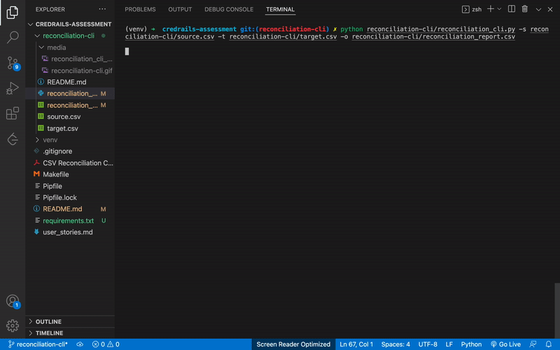

# CSV Reconciler

## Overview

CSV Reconciler is a tool designed to facilitate the reconciliation of data between two CSV files. This tool is available both as a Command Line Interface (CLI) and as a Graphical User Interface (GUI).

## Table of Contents

- [Installation](#installation)
- [Usage](#usage)
  - [CLI Usage](#cli-usage)
  - [GUI Usage](#gui-usage)
- [Common Issues and Solutions](#common-issues-and-solutions)
- [Contributing](#contributing)
- [Screenshots](#screenshots)
- [License](#license)

## Installation

1. **Clone the Repository and Checkout `reconciliation-cli` Branch:**
   ```bash
   git clone https://github.com/EKibet/csv_reconciliation.git
   cd csv-reconciler
   git checkout reconciliation-cli
   ```

2. **Create a Virtual Environment (Optional but Recommended):**
   ```bash
   python -m venv venv
   ```

3. **Activate the Virtual Environment:**
   - On Windows:
     ```bash
     venv\Scripts\activate
     ```
   - On Unix or MacOS:
     ```bash
     source venv/bin/activate
     ```

4. **Install Dependencies:**
   ```bash
   pip install -r requirements.txt
   ```

5. **Make the CLI Executable (Unix/MacOS):**
   ```bash
   chmod +x csv_reconciler.py
   ```

## Usage

### CLI Usage
#### CLI Options:

- `-s` or `--source`: Path to the source CSV file.
- `-t` or `--target`: Path to the target CSV file.
- `-o` or `--output`: Path to save the output reconciliation report.

#### Example:
```bash
 python reconciliation-cli/reconciliation_cli.py -s reconciliation-cli/source.csv -t reconciliation-cli/target.csv -o reconciliation-cli/reconciliation_report.csv
```

1. **Choose Source CSV:**
   Click the "Browse" button to select the source CSV file.

2. **Choose Target CSV:**
   Click the "Browse" button to select the target CSV file.

3. **Run Reconciliation:**
   Click the "Run Reconciliation" button to initiate the reconciliation process.

4. **View Results:**
   After reconciliation, click the "View Results" button to see the reconciliation report.

## Common Issues and Solutions

1. **File Not Found:**
   - Ensure that the provided file paths are correct.
   - Check file names for typos.

2. **Invalid CSV Format:**
   - Verify that the CSV files are well-formatted with headers.

3. **Permission Denied:**
   - Ensure that you have the necessary permissions to read/write files in the specified directories.

4. **No Python Interpreter Found:**
   - Add the shebang line (`#!/usr/bin/env python`) at the beginning of the script.
   - Ensure the script is executable (`chmod +x csv_reconciler.py`).

## Contributing

Feel free to contribute by opening issues or submitting pull requests. Your feedback is highly appreciated!


## Screenshots

Screenshots to visually demonstrate how to use the tool.

### CLI Tool in Action



## License

This project is licensed under the [MIT License](LICENSE).
