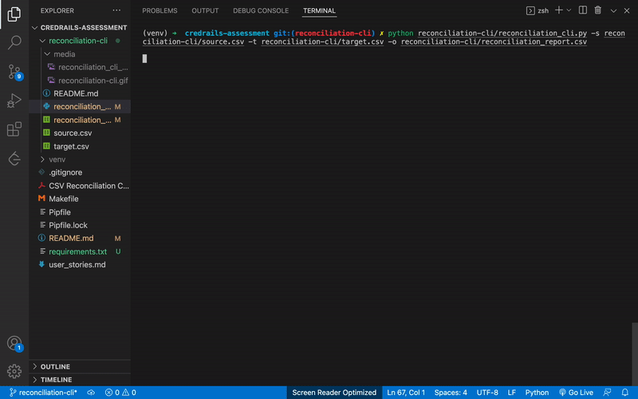

# Reconciliation Toolkit

Welcome to the Reconciliation Toolkit, a versatile toolset for reconciling CSV files with ease. This toolkit provides both a Command Line Interface (CLI) and a Graphical User Interface (GUI) to streamline the reconciliation process.

For detailed descriptions of user stories or system requirements, please refer to [user stories](user_stories.md).

## Overview

The Reconciliation Toolkit offers two main components:

1. **Reconciliation CLI:**
   - For detailed instructions on using the CLI, please refer to the [CLI README](reconciliation-cli/README.md).
   - The CLI allows you to reconcile CSV files through a command-line interface, providing a summary of discrepancies and saving a reconciliation report.

2. **Reconciliation GUI:**
   - For the GUI tool, check out the [GUI-Tool README](reconciliation_gui/README.md).
   - The GUI simplifies the reconciliation process with a user-friendly interface, allowing you to select source and target CSV files, run reconciliation, view results visually and save a reconciliation report.

## Installation

1. **Clone the Repository and Checkout `reconciliation-cli` Branch:**
   ```bash
   git clone https://github.com/EKibet/csv_reconciliation.git
   cd csv_reconciliation
   ```

2. **Create a Virtual Environment (Optional but Recommended):**
   ```bash
   python -m venv venv
   ```

3. **Activate the Virtual Environment:**
   - On Windows:
     ```bash
     venv\Scripts\activate
     ```
   - On Unix or MacOS:
     ```bash
     source venv/bin/activate
     ```

4. **Install Dependencies:**
   ```bash
   pip install -r requirements.txt
   ```

## Usage

1. **Reconciliation CLI:**
   - On your terminal run:
      ```bash
      make cli
      ```
      or  
      ```bash
      python3 reconciliation-cli/reconciliation_cli.py -s reconciliation-cli/source.csv -t reconciliation-cli/target.csv -o reconciliation-cli/reconciliation_report.csv
      ```
   - **Choose Source CSV:**
      Click the "Browse" button to select the source CSV file.

   - **Choose Target CSV:**
      Click the "Browse" button to select the target CSV file.

   - **Run Reconciliation:**
      Click the "Run Reconciliation" button to initiate the reconciliation process.

   - **View Results:**
      After reconciliation, click the "View Results" button to see the reconciliation report.

2. **Reconciliation GUI:**
   - Run the following command to launch the GUI tool:
      ```bash
      make gui
      ```
      or  
      ```bash
      python3 reconciliation_gui/reconciliation_gui.py
      ```

## Viewing Results

After the reconciliation, access the report in the `media` directory:

### Option 1: Manual Viewing

1. Navigate to the media directory within the project folder.
2. Locate the CSV file with a unique timestamp (e.g., 20230101235959.csv).
3. Open the CSV file using a spreadsheet application like Microsoft Excel or Google Sheets to inspect detailed reconciliation results.

### Option 2: In-GUI Viewing

Click on the "View Results" button within the GUI after the reconciliation process is complete. The reconciliation report will be displayed directly in the GUI, enabling you to inspect discrepancies without using an external spreadsheet application.

### Exit the GUI

Close the GUI window when you have completed the reconciliation process.

## Demo

Here's a brief demonstration of how the Reconciliation Toolkit works:
### Demo for both tools
1[Reconciliation CLI & GUI Tools Demo](https://github.com/EKibet/csv_reconciliation/tree/development)


### CLI Tool in Action


<br>
<br>

### GUI Tool in Action


## Future Implementations

We are continuously working to enhance the Reconciliation Toolkit. Future improvements may include:

- Allow users to configure which columns to compare, in case some columns should be ignored.
- Integration with cloud storage services.
- Performance optimizations for large datasets through the use of Dask for parallel processing.

## Contributing

Contributions are welcome! If you have suggestions, bug reports, or feature requests, please open an issue.

## License

This project is licensed under the [MIT License](LICENSE).
